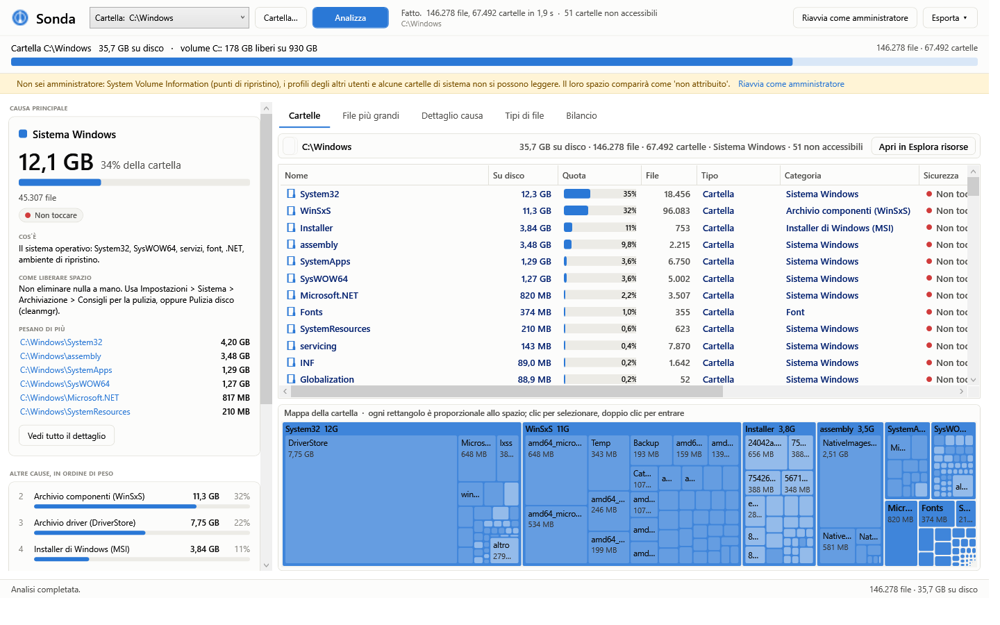

# Sonda — dove è finito lo spazio del disco

*[Read in English](README.md)*

[](https://github.com/seremanuels-create/sonda/releases/latest)
[](https://github.com/seremanuels-create/sonda/releases)
[](https://github.com/seremanuels-create/sonda/actions/workflows/build.yml)
[](LICENSE)

Analizzatore dello spazio su disco per Windows: dice **cosa** occupa spazio, **dove** sta, **cos'è** e **come si libera**, mettendo la causa principale in primo piano e tutte le altre in ordine di peso.

Un'alternativa libera e open source a WinDirStat, TreeSize e WizTree — con una differenza: non si limita a mostrarti una mappa, ti dice qual è la causa e cosa farci.

Non è l'ennesimo albero di cartelle: ogni file viene classificato in una *causa* (giochi, cache dei browser, dipendenze dei progetti, punti di ripristino, ibernazione…) con una spiegazione in italiano e un livello di sicurezza — **eliminabile**, **da valutare**, **non toccare**.



- **Windows 10/11 a 64 bit.** Nessuna dipendenza: l'eseguibile portable contiene già il runtime .NET.
- Un disco da un milione di file si legge in **5–15 secondi** su SSD.
- Interfaccia in **italiano e inglese** (Impostazioni → Lingua), licenza MIT.

## Scarica

Nella pagina [Releases](../../releases):

- `Sonda-<versione>-portable.zip` — estrai ed esegui `Sonda.exe`, non installa nulla e non scrive nel registro;
- `Sonda-<versione>-Setup.exe` — installer (per utente, senza richiesta di amministratore).

I binari non sono firmati: al primo avvio SmartScreen può avvisare ("editore sconosciuto") → *Ulteriori informazioni → Esegui comunque*.

## Cosa mostra

| Zona | Cosa c'è |
|---|---|
| **Causa principale** (a sinistra, in alto) | La categoria che pesa di più: quanto occupa, quota sullo spazio usato, cos'è, come si libera, livello di sicurezza e le cartelle più pesanti al suo interno. |
| **Altre cause** | Tutte le altre in ordine di peso, con barra proporzionale. Clic → dettaglio. |
| **Cartelle** | Esploratore ordinato per dimensione con breadcrumb: su disco, quota, numero di file, tipo, categoria, sicurezza, data, note (giunzione, accesso negato, file cloud). Sotto, la **mappa** (treemap) della cartella. |
| **File più grandi** | I 2000 file più grandi, filtrabili per testo e categoria; ogni riga dice cos'è, dove sta, a che causa appartiene, se si può eliminare. Selezione multipla → Cestino. |
| **Dettaglio causa** | Per ogni causa: cartelle più pesanti (doppio clic per entrarci) e file più grandi. |
| **Tipi di file** | Cosa sono i file (video, audio, librerie, dischi virtuali, cache…) indipendentemente da dove stanno. |
| **Bilancio** | Spazio usato secondo Windows contro spazio trovato nei file: MFT (letta dal volume o stimata), copie shadow (WMI), cartelle non accessibili, giunzioni saltate, e quanto resta "non attribuito" con la spiegazione del perché. |

Tasto destro su qualsiasi riga: apri in Esplora risorse, mostra nella cartella, entra, copia percorso, proprietà, **elimina** (nel Cestino, con conferma e avviso se la categoria è "non toccare").

## Come sono calcolate le dimensioni

La colonna principale è **su disco**: i byte davvero occupati dal volume.

- Dimensione arrotondata al cluster; su NTFS i file fino a ~700 byte contano 0 (risiedono nel record MFT).
- File compressi NTFS e sparse: dimensione allocata reale (`GetCompressedFileSize`).
- Segnaposto cloud (OneDrive "solo online"): contano per lo spazio locale, cioè in pratica zero. I file `RECALL_ON_OPEN` non vengono aperti, per non provocarne lo scaricamento.
- Giunzioni e collegamenti simbolici **non** vengono seguiti: il contenuto è contato dove sta davvero. I reparse point cloud/WCI/ProjFS sì.
- `Windows\WinSxS` è mostrato **lordo**: molti file sono hard link condivisi con `System32`, quindi lo spazio reale è inferiore. L'app lo dice nella descrizione della categoria.

Le etichette di sicurezza sono euristiche per categoria e percorso: guarda sempre il percorso prima di eliminare. Tutto passa dal Cestino.

## Riga di comando

```
Sonda.exe C:\                              apre l'interfaccia e analizza subito
Sonda.exe --report C:\ --out rapporto.txt  rapporto completo in testo, senza finestra
Sonda.exe --report C:\ --csv cartella      + tre CSV (file più grandi, cartelle, cause)
Sonda.exe --report C:\ --lang en           forza la lingua per questa esecuzione (it | en)
```

## Compilare

Serve l'[SDK .NET 9](https://dotnet.microsoft.com/download) (`winget install Microsoft.DotNet.SDK.9`); per l'installer anche [Inno Setup 6](https://jrsoftware.org/isdl.php).

```powershell
.\build.ps1                # portable single-file + zip + installer, in dist\
.\build.ps1 -SoloPortable  # solo l'eseguibile
```

Per lo sviluppo, usando il runtime già installato:

```powershell
dotnet build -c Debug -p:SelfContained=false -p:PublishSingleFile=false
.\bin\Debug\net9.0-windows\win-x64\Sonda.exe C:\
```

Firma Authenticode (facoltativa): `.\build.ps1 -Firma` usa gli script indicati dalle variabili d'ambiente `SONDA_FIRMA_PS1` (firma i binari) e `SONDA_FIRMA_CMD` (chiamato da Inno Setup per setup e disinstallatore).

## Tradurre

`Core/Strings.It.cs` e `Core/Strings.En.cs` hanno le stesse ~420 chiavi. Per aggiungere una lingua: copia uno dei due file, traduci i valori, aggiungi la voce all'enum `Lang` e all'elenco della finestra Impostazioni. Le chiavi mancanti ripiegano sull'italiano, quindi una traduzione parziale funziona lo stesso.

## Com'è fatto

```
Core\   Native.cs (Win32), Model.cs, Scanner.cs (scansione parallela), Classifier.cs (categorie, tipi, regole),
        Analysis.cs (cause, top file, tipi, bilancio), ShadowStorage.cs (WMI), Report.cs (testo/CSV),
        ShellOps.cs (Esplora risorse, Cestino, elevazione), Format.cs, Loc.cs + Strings.It.cs / Strings.En.cs
UI\     Theme.xaml, Converters.cs, Rows.cs (righe e ordinamento colonne), TreemapControl.cs (treemap squarified)
```

La scansione mette ogni cartella in coda e la fa enumerare da N thread con `FileSystemEnumerable` (una chiamata al kernel per blocco di voci, senza `stat` per file), usando percorsi estesi `\\?\` per superare il limite dei 260 caratteri.

## Aggiungere una regola di classificazione

Tutto in `Core/Classifier.cs`:

- `Categories` — id, nome, famiglia (colore), sicurezza, descrizione ("cos'è"), azione ("come liberare");
- `RootRules` — percorsi ancorati alla radice del volume, minuscoli; `*` = un segmento qualsiasi, `xxx*` = prefisso. L'ultimo numero indica quanti segmenti sotto l'ancora formano il "gruppo" mostrato nel dettaglio causa;
- `AnywhereRules` — nomi di cartella validi ovunque (`node_modules`, `.git`, `cache`…), limitati ai contesti in cui hanno senso;
- tipi di file: `Ext(etichetta, descrizione, estensioni…)` nel costruttore statico (ogni estensione va dichiarata una volta sola: un duplicato genera un errore all'avvio).

I contributi sono benvenuti, soprattutto nuove regole per programmi e giochi che occupano molto spazio.

## Licenza

[MIT](LICENSE) — © 2026 StarVerb Audio.
