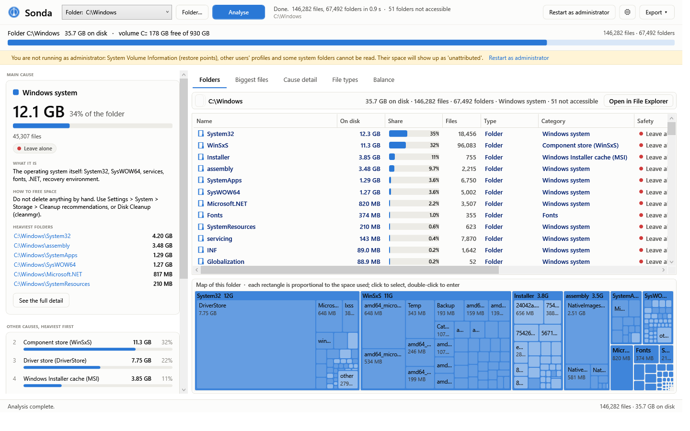

# Sonda — where your disk space went

*[Leggi in italiano](README.it.md)*

[](https://github.com/seremanuels-create/sonda/releases/latest)
[](https://github.com/seremanuels-create/sonda/releases)
[](https://github.com/seremanuels-create/sonda/actions/workflows/build.yml)
[](LICENSE)

A disk space analyser for Windows that tells you **what** is using the space, **where** it lives, **what it is** and **how to free it** — putting the main cause in the foreground and every other cause right behind it, heaviest first.

A free, open-source alternative to WinDirStat, TreeSize and WizTree — with one difference: it does not just show you a treemap, it names the cause and tells you what to do about it.

It is not yet another folder tree: every file is sorted into a *cause* (games, browser caches, project dependencies, restore points, hibernation…) with a plain-language explanation and a safety level — **safe to delete**, **your call**, **leave alone**.



- **Windows 10/11, 64-bit.** No dependencies: the portable executable already contains the .NET runtime.
- A drive with a million files is read in **5–15 seconds** on an SSD.
- Interface in **English and Italian** (Settings → Language), MIT licensed.

## Download

From the [Releases](../../releases) page:

- `Sonda-<version>-portable.zip` — unzip and run `Sonda.exe`; it installs nothing and writes nothing to the registry;
- `Sonda-<version>-Setup.exe` — installer (per-user, no administrator prompt).

The binaries are not code-signed: on first run SmartScreen may warn about an "unknown publisher" → *More info → Run anyway*.

## What it shows

| Area | What is there |
|---|---|
| **Main cause** (top left) | The heaviest category: how much it takes, its share of the used space, what it is, how to free it, its safety level, and the heaviest folders inside it. |
| **Other causes** | Every other category, heaviest first, with a proportional bar. Click one for the detail. |
| **Folders** | A size-ordered explorer with breadcrumbs: on disk, share, file count, type, category, safety, date, notes (junction, access denied, cloud file). Below it, a **treemap** of the current folder. |
| **Biggest files** | The 2000 biggest files, filterable by text and category; each row says what it is, where it lives, which cause it belongs to and whether it is safe to delete. Multi-select → Recycle Bin. |
| **Cause detail** | Per cause: heaviest folders (double-click to enter) and biggest files. |
| **File types** | What the space-eating files actually are (video, audio, libraries, virtual disks, caches…), wherever they live. |
| **Balance** | The space Windows calls "used" against the space found in files: MFT (read from the volume or estimated), shadow copies (WMI), inaccessible folders, skipped junctions, and whatever is left "unattributed", with the reason why. |

Right-click any row: open in File Explorer, show in folder, enter, copy path, properties, **delete** (to the Recycle Bin, with a confirmation and a warning when the category is "leave alone").

## How sizes are computed

The main column is **on disk**: the bytes the volume actually gives up.

- Sizes are rounded up to the cluster; on NTFS, files up to ~700 bytes count as 0 (they live inside the MFT record).
- NTFS-compressed and sparse files: real allocated size (`GetCompressedFileSize`).
- Cloud placeholders (OneDrive "online-only"): counted for their local footprint, which is usually zero. `RECALL_ON_OPEN` files are never opened, so nothing is downloaded behind your back.
- Junctions and symbolic links are **not** followed: their content is counted where it really lives. Cloud/WCI/ProjFS reparse points are.
- `Windows\WinSxS` is shown **gross**: many of its files are hard links shared with `System32`, so the real figure is lower. The app says so in the category description.

Safety labels are heuristics based on category and path: always look at the path before deleting. Everything goes through the Recycle Bin.

## Command line

```
Sonda.exe C:\                              open the UI and start analysing
Sonda.exe --report C:\ --out report.txt    full text report, no window
Sonda.exe --report C:\ --csv folder        plus three CSV files (biggest files, folders, causes)
Sonda.exe --report C:\ --lang en           force the language for this run (it | en)
```

## Building

You need the [.NET 9 SDK](https://dotnet.microsoft.com/download) (`winget install Microsoft.DotNet.SDK.9`); for the installer also [Inno Setup 6](https://jrsoftware.org/isdl.php).

```powershell
.\build.ps1                # portable single-file + zip + installer, into dist\
.\build.ps1 -SoloPortable  # just the executable
```

For development, using the runtime already installed:

```powershell
dotnet build -c Debug -p:SelfContained=false -p:PublishSingleFile=false
.\bin\Debug\net9.0-windows\win-x64\Sonda.exe C:\
```

Authenticode signing is optional: `.\build.ps1 -Firma` uses the scripts named by the `SONDA_FIRMA_PS1` (signs the binaries) and `SONDA_FIRMA_CMD` (called by Inno Setup for the setup and the uninstaller) environment variables.

## How it is built

```
Core\   Native.cs (Win32), Model.cs, Scanner.cs (parallel scan), Classifier.cs (categories, types, rules),
        Analysis.cs (causes, top files, types, balance), ShadowStorage.cs (WMI), Report.cs (text/CSV),
        ShellOps.cs (Explorer, Recycle Bin, elevation), Format.cs, Loc.cs + Strings.It.cs / Strings.En.cs
UI\     Theme.xaml, Converters.cs, Rows.cs (rows and column sorting), TreemapControl.cs (squarified treemap)
```

The scanner queues every folder and hands it to N threads using `FileSystemEnumerable` (one kernel call per block of entries, no `stat` per file), with extended `\\?\` paths so the 260-character limit does not apply.

## Adding a classification rule

Everything lives in `Core/Classifier.cs`:

- `Categories` — id, key, family (colour), safety level. Name, description and action come from the string tables;
- `RootRules` — paths anchored at the volume root, lowercase; `*` matches one segment, `xxx*` matches a prefix. The trailing number says how many segments below the anchor form the "group" shown in the cause detail;
- `AnywhereRules` — folder names that count anywhere (`node_modules`, `.git`, `cache`…), restricted to the contexts where they make sense;
- file types: `Ext(key, extensions…)` in the static constructor (each extension may be declared once only — a duplicate throws at startup).

## Translating

`Core/Strings.It.cs` and `Core/Strings.En.cs` hold the same ~420 keys. To add a language: copy one of the files, translate the values, add the entry to the `Lang` enum and to the picker in `SettingsWindow`. Missing keys fall back to Italian, so a partial translation still runs.

Contributions are welcome, especially new rules for programs and games that eat a lot of space.

## Licence

[MIT](LICENSE) — © 2026 StarVerb Audio.
